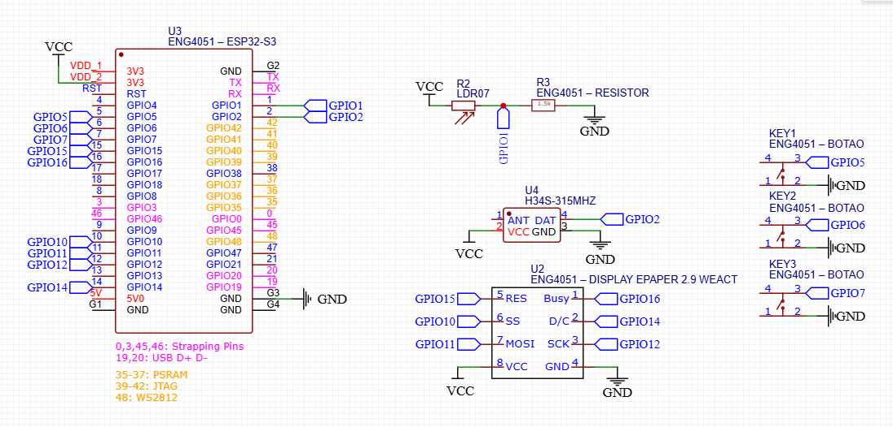
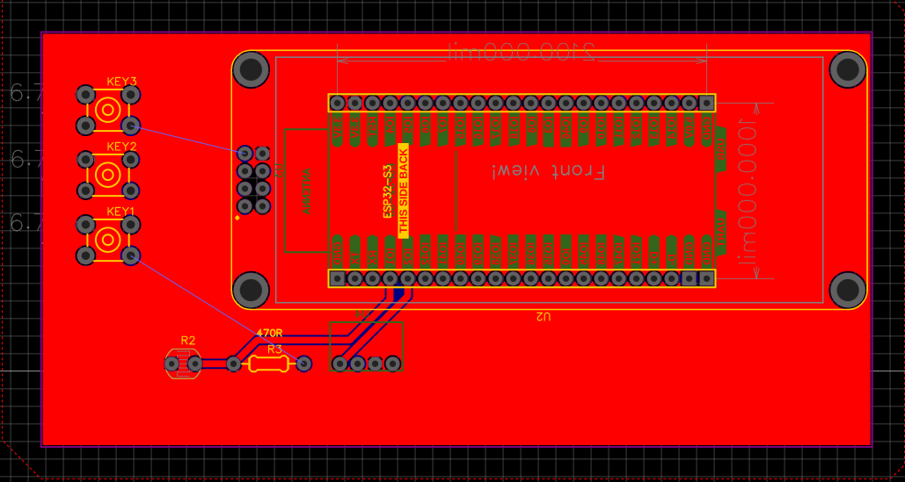
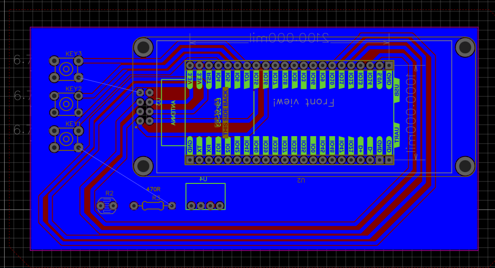
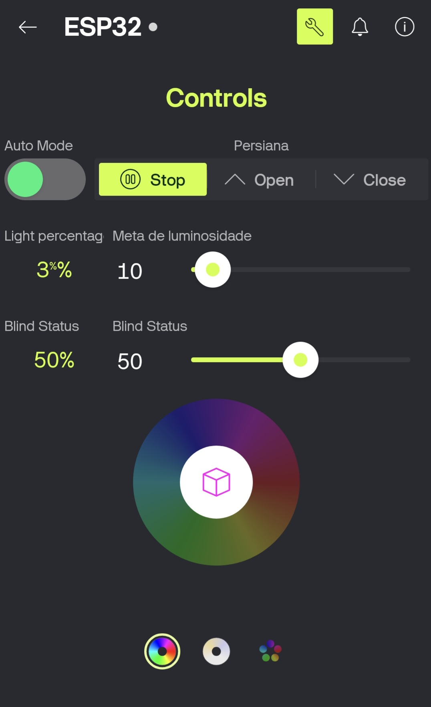
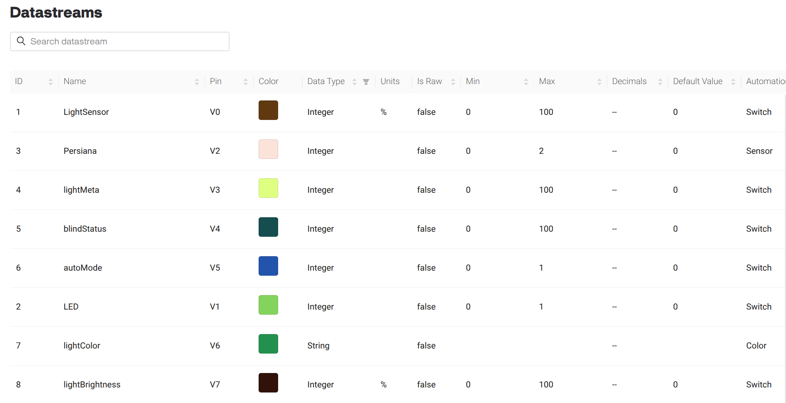
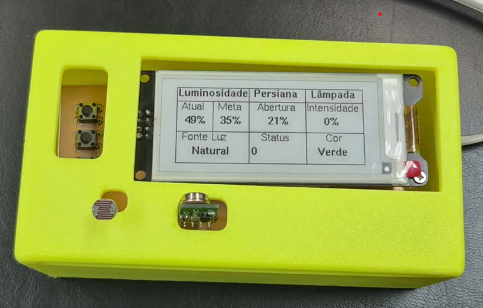

# Sistema Inteligente de Controle de Luz e Persiana (IoT)

## Sobre o Projeto

Este projeto propõe um sistema de automação residencial e predial focado no conforto visual e eficiência energética. O objetivo principal é criar um ambiente inteligente capaz de controlar automaticamente a iluminação (natural e artificial), adaptando-se às necessidades do usuário, seja para estudo, reuniões ou apresentações.

O "cérebro" do sistema embarcado é um **ESP32-S3**, que gerencia sensores, um display E-Paper e atua sobre uma persiana motorizada e lâmpadas inteligentes. O sistema opera em dois modos principais:
1.  **Manual:** Controle direto via Dashboard Mobile, Telegram (criar e utilizar presets) e botões físicos na case do protóripo (controle da persiana).
2.  **Automático:** O sistema monitora a luminosidade em tempo real (Lux) e ajusta a abertura da persiana ou a intensidade da luz para atingir uma meta pré-estabelecida (SetPoint).

> **Nota:** Embora o projeto original previsse controle por voz, esta versão foca na robustez do controle via MQTT, Node-RED e Dashboards, não incluindo integração com Alexa nesta etapa.

---

## Arquitetura do Sistema

O sistema utiliza uma arquitetura IoT baseada em MQTT para comunicação entre o hardware e a nuvem.

> **[ESPAÇO RESERVADO PARA EXPLICAÇÃO DA ARQUITETURA]** 
> Como o Francisco mudou bastante coisa da arquitetura ontem, adicionando um Fluxo de duas etapas, melhor que ele explique essa parte.\
> *Insira aqui o diagrama ou texto explicativo sobre o fluxo: ESP32 <-> Broker MQTT <-> Node-RED <-> Banco de Dados/Dashboards.*

### Esquemático Eletrônico
O circuito foi desenhado no EasyEDA, integrando o ESP32, módulos de RF e sensores.

> 

### PCB (Placa de Circuito Impresso)
Abaixo, as visões da placa desenvolvida e soldada para o projeto.

> 
> 

---

## O Código (Firmware ESP32)

O firmware foi desenvolvido em C++ utilizando a plataforma Arduino/PlatformIO. O fluxo principal do código funciona da seguinte maneira:

1.  **Conectividade:** O ESP32 se conecta ao WiFi e estabelece uma conexão segura (TLS) com o Broker MQTT (`mqtt.janks.dev.br`), conforme visto em aula.
2.  **Sensoriamento:** A cada 3 segundos, o sistema lê o sensor de luz LDR, converte o valor para porcentagem (0-100%) e publica no tópico `ds/LightSensor`.
3.  **Interface Local:** Um display **E-Paper** (GxEPD2) exibe o status atual, meta de luz e estado da persiana.
4.  **Atuação (Lógica de Controle):**
    * O sistema subscreve aos tópicos de comando (`downlink/#`).
    * No **Modo Automático**, ele compara a luz atual com a meta (`metaNum`). Se a luz estiver abaixo da meta, ele aciona a subida da persiana; se estiver acima, ele a desce, buscando o equilíbrio (tolerância de ±5% devido ao comportamento variante da luz).
    * O código calcula o tempo de acionamento do motor para estimar a porcentagem de abertura da persiana (0% a 100%).

### Principais Bibliotecas Utilizadas
* `WiFiClientSecure` & `MQTT`: Para comunicação segura com a nuvem.
* `RCSwitch`: Para clonar o controle remoto da persiana (RF 315MHz).
* `GxEPD2` & `U8g2_for_Adafruit_GFX`: Para controle avançado do display e-Paper.
* `Preferences`: Para salvar o estado da persiana e modos na memória não volátil (NVS), garantindo que o sistema lembre sua posição após reiniciar.

---

## Hackeando a Persiana (RF 315MHz)

Para evitar a troca do motor original da persiana, precisamos utilizar o sensor de Radiofrequência (RF).

1.  **Receptor:** Utilizamos um módulo receptor RF para "escutar" e decodificar os sinais do controle remoto original da persiana. Identificamos os códigos hexadecimais únicos para SUBIR, DESCER e PARAR.
2.  **Emissor:** No circuito do projeto, integramos um transmissor RF. O ESP32 utiliza a biblioteca `RCSwitch` para enviar esses mesmos códigos, "enganando" o motor da persiana, que responde como se fosse o controle original.

*Códigos mapeados:*
* `UP_CODE`: 2448754
* `DOWN_CODE`: 2448756
* `STOP_CODE`: 2448760

---

## Integrações e Plataformas

### Blynk (App Mobile)
O Blynk é utilizado como a interface na palma da mão do usuário, permitindo a visualização do status atual de luz e o controle da persiana remotamente.

> Interface do Blynk:

 
> O dashboard do Blynk foi desenvolvido para atuar como a Central de Comando do sistema, comunicando-se com o ESP32 via protocolo MQTT. A interface oferece controle total e feedback em tempo real através dos seguintes elementos:
  

- Controle de Modos: Um switch permite alternar entre o Modo Automático (autoMode), onde o sistema persegue a meta de luz, e o manual.

- Acionamento da Persiana: Botões dedicados (Open, Close, Stop) enviam comandos imediatos para o motor, enquanto um slider permite definir uma posição percentual específica (ex: abrir exatamente em 50%).

- Gestão de Luminosidade: O usuário define o setpoint de luz desejado (Meta) através de um slider. O sistema visualiza em tempo real a Luminosidade Atual captada pelo sensor LDR (exibida como Light percentage), permitindo acompanhar a resposta do ambiente às mudanças.

- Controle de Iluminação: Um widget de disco de cores permite o ajuste da cor e intensidade da lâmpada inteligente, integrando a luz artificial ao cenário

> Datastreams e Comunicação MQTT:

 
A comunicação bidirecional do Blynk com a lógica de controle é totalmente baseada no protocolo **MQTT**. Essa troca de informações é viabilizada pelos **Datastreams**, que atuam como o principal canal de dados da aplicação.

* **Datastreams Virtuais:** Cada widget da interface (botão, slider, display de valor) é associado a um Datastream virtual (ex: V0, V1, V2). Estes funcionam como variáveis remotas que armazenam e transferem dados.

* **Encapsulamento MQTT:** O Blynk encapsula automaticamente a atualização de cada Datastream em uma mensagem **MQTT** e a publica em um tópico dedicado.
    * **Comandos:** Quando o usuário move um slider, o novo valor é imediatamente enviado via MQTT para o sistema.
    * **Feedback:** Dados do ambiente (como a luminosidade atual ou a posição da persiana) são recebidos via MQTT e usados para atualizar o display de valor do Datastream correspondente na interface, garantindo o feedback em tempo real.
 
* **Independência de Plataforma:** Essa abordagem via MQTT permite que qualquer sistema (ESP32, um servidor lógico, etc.) que se inscreva (subscribe) nos tópicos corretos possa receber os comandos e enviar os dados de volta para o aplicativo.

### Node-RED (Regras de Negócio)
O Node-RED atua como o orquestrador do sistema, recebendo as mensagens do Telegram e os dados do Blynk e do ESP32 via MQTT, processando lógicas complexas e salvando dados no banco PostgreSQL.

> **[PARTE FRANCISCO]**
> *Insira aqui a explicação sobre os fluxos do Node-RED.*

### Lâmpada Inteligente (Tuya)
A integração com a iluminação artificial permite criar cenas híbridas.

> **[FRANCISCO]**
> *Insira aqui como foi feita a integração da lâmpada Tuya.*

---

## Dashboards e Resultados

Aqui apresentamos como os dados de Log podem ser vistos. Francisco coloca prints do grafana aqui

> **[CAPTURA DE TELA DO DASHBOARD GRAFANA]**

### Vídeo de Demonstração
Veja o sistema em funcionamento:

> **[IFRAME OU LINK DO VÍDEO DO PROJETO]**

---

## Montagem Prática (Laboratório)

A materialização do projeto envolveu a soldagem dos componentes na PCB projetada e a criação de um case para acomodar a eletrônica. Utilizamos impressão 3D para garantir que o "Módulo Inteligente" pudesse ser fixado na parede de forma estética e funcional.

> 

---

## Conclusão

A realização deste protótipo demonstrou a viabilidade técnica de controlar a iluminação de ambientes variáveis utilizando tecnologias acessíveis como o ESP32. O sistema foi capaz de manter níveis de conforto visual mesclando luz natural (via persiana) e artificial, provando que a automação residencial DIY pode ser robusta, eficiente e personalizável.

---
*Projeto desenvolvido para a disciplina de IoT - 2025.2*
